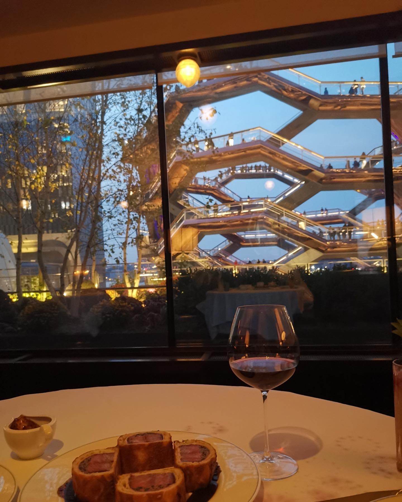

```{r setup, include=FALSE}
knitr::opts_chunk$set(echo = TRUE)
```


I am a biostatistics MS student at Columbia University Mailman School of Public Health. I am mainly interested in clustering analysis and survival analysis, particularly in application to global health and health disparities. In this way, I want to be a global citizen who can contribute to the world. 


This is a image of my view 


This is my cat 


And this is a image of  my recent fav food 



kk
